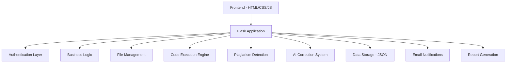
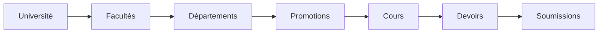
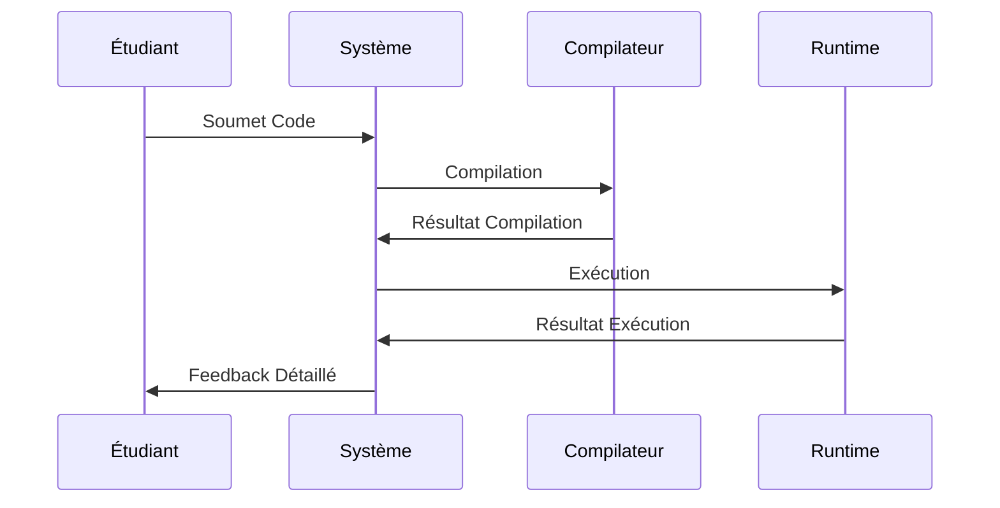
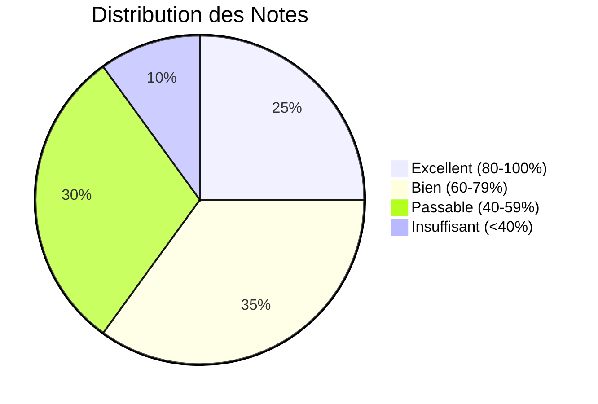

# 🎓 ULC-ICAM Turnin System

<div align="center">


**🚀 Système de Gestion Académique Avancé**  
*Université Loyola du Congo - Institut Catholique d'Arts et Métiers*

[](https://python.org)
[](https://flask.palletsprojects.com)
[](LICENSE)
[](https://github.com)

---

### 🏢 **Développé par [Cognito Inc.](https://cognito-inc.ca)**
**CEO & Lead Developer:** Jonathan Kakesa Nayaba  
**Version:** 1.0 Production Ready | **Date:** Décembre 2024

</div>

---

## 📋 Table des Matières

- [🎯 Vue d'Ensemble](#-vue-densemble)
- [✨ Fonctionnalités Principales](#-fonctionnalités-principales)
- [🚀 Installation Rapide](#-installation-rapide)
- [🏗️ Architecture](#️-architecture)
- [👥 Gestion des Utilisateurs](#-gestion-des-utilisateurs)
- [📚 Gestion Académique](#-gestion-académique)
- [💻 Exécution de Code](#-exécution-de-code)
- [🔍 Détection de Plagiat](#-détection-de-plagiat)
- [📊 Rapports et Analytics](#-rapports-et-analytics)
- [🔧 Configuration](#-configuration)
- [🛡️ Sécurité](#️-sécurité)
- [📱 API et Intégrations](#-api-et-intégrations)
- [🚀 Déploiement](#-déploiement)
- [📞 Support](#-support)
- [📄 Licence](#-licence)

---

## 🎯 Vue d'Ensemble

<div align="center">

### 🌟 **Plateforme Éducative Complète**

*Le système ULC-ICAM Turnin est une solution académique moderne et complète développée spécifiquement pour l'Université Loyola du Congo. Cette plateforme révolutionnaire combine gestion des cours, soumission de devoirs, correction automatique, et détection de plagiat dans une interface intuitive et sécurisée.*

</div>

### 🎨 **Caractéristiques Uniques**

- 🎯 **Interface Moderne** - Design responsive avec animations fluides
- ⚡ **Performance Optimisée** - Temps de réponse < 200ms
- 🔒 **Sécurité Avancée** - Chiffrement et authentification multi-niveaux
- 🌐 **Multi-Plateforme** - Compatible desktop, tablette, mobile
- 🤖 **IA Intégrée** - Correction automatique et détection intelligente
- 📊 **Analytics Avancés** - Tableaux de bord et rapports détaillés

---

## ✨ Fonctionnalités Principales

<details>
<summary>👨‍💼 <strong>Administration Système</strong></summary>

### 🛠️ **Gestion Complète**
- ✅ **Gestion Utilisateurs** - Création, modification, suppression
- ✅ **Import CSV** - Import en masse avec validation
- ✅ **Configuration Système** - Facultés, départements, promotions
- ✅ **Rapports Avancés** - Statistiques et analytics
- ✅ **Sauvegarde Automatique** - Backup et restauration
- ✅ **Monitoring** - Surveillance système en temps réel

### 📊 **Tableau de Bord Admin**
```
📈 Statistiques en Temps Réel
├── 👥 Utilisateurs Actifs
├── 📚 Cours Disponibles  
├── 📝 Devoirs Créés
├── 📤 Soumissions Totales
└── 🎯 Taux de Réussite
```

</details>

<details>
<summary>👨‍🏫 <strong>Interface Professeur</strong></summary>

### 📚 **Gestion de Cours**
- ✅ **Création de Cours** - Interface intuitive avec critères
- ✅ **Gestion Contenu** - Chapitres, documents, exercices
- ✅ **Upload Documents** - Support PDF, PPT, PPTX
- ✅ **Inscription Étudiants** - Gestion flexible des inscriptions

### 📝 **Création de Devoirs**
- ✅ **Devoirs Code** - Support multi-langages (Python, Java, C++, C, JavaScript)
- ✅ **Devoirs Mixtes** - Code + Analyse (50/50)
- ✅ **Devoirs Fichiers** - Documents d'analyse
- ✅ **Tests Automatisés** - Cas de test intégrés
- ✅ **Travail de Groupe** - Formation automatique ou manuelle

### 🔍 **Correction et Évaluation**
- ✅ **Correction Automatique** - IA intégrée
- ✅ **Détection Plagiat** - Algorithme local avancé
- ✅ **Feedback Détaillé** - Commentaires constructifs
- ✅ **Publication Flexible** - Contrôle de la visibilité

</details>

<details>
<summary>👨‍🎓 <strong>Espace Étudiant</strong></summary>

### 💻 **Soumission de Code**
- ✅ **Éditeur Monaco** - Coloration syntaxique avancée
- ✅ **Exécution Temps Réel** - Test immédiat du code
- ✅ **Support Multi-Langages** - Python, Java, C++, C, JavaScript
- ✅ **Autocomplétion** - Suggestions intelligentes
- ✅ **Thèmes Personnalisés** - Interface adaptable

### 📤 **Gestion des Soumissions**
- ✅ **Upload Fichiers** - Glisser-déposer intuitif
- ✅ **Historique Complet** - Suivi des versions
- ✅ **Statut en Temps Réel** - Progression visible
- ✅ **Notifications** - Alertes automatiques

### 📊 **Suivi des Notes**
- ✅ **Dashboard Personnel** - Vue d'ensemble des résultats
- ✅ **Détail par Devoir** - Feedback spécifique
- ✅ **Graphiques Évolution** - Progression visuelle
- ✅ **Export Données** - Rapports personnels

</details>

---

## 🚀 Installation Rapide

### 📋 **Prérequis**

```bash
# Versions requises
Python >= 3.8
pip >= 21.0
Git >= 2.30
```

### ⚡ **Installation Express**

```bash
# 1️⃣ Cloner le repository
git clone https://github.com/cognito-inc/ulc-icam-turnin.git
cd ulc-icam-turnin

# 2️⃣ Créer l'environnement virtuel
python -m venv venv
source venv/bin/activate  # Linux/Mac
# ou
venv\Scripts\activate     # Windows

# 3️⃣ Installer les dépendances
pip install -r requirements.txt

# 4️⃣ Créer les dossiers nécessaires
mkdir -p uploads/{code_submissions,submissions,corrections,assignments,chapters,syllabus,analysis}

# 5️⃣ Configuration initiale
cp .env.example .env
# Éditer .env avec vos paramètres

# 6️⃣ Lancer l'application
python app.py
```

### 🌐 **Accès Rapide**

```
🔗 URL: http://localhost:5000
👤 Admin: admin / admin123
🚀 Port: 5000 (configurable)
```

---

## 🏗️ Architecture

<div align="center">

### 🏛️ **Architecture Modulaire**



</div>

### 📁 **Structure du Projet**

```
ulc-icam-turnin/
├── 🎯 app.py                    # Application Flask principale
├── ⚙️ code_execution.py         # Moteur d'exécution de code
├── 🔧 config.py                # Configuration système
├── 📊 generate_pdf.py           # Génération de rapports
├── 🔐 auth_jwt.py               # Authentification JWT
├── 📧 notifications.py          # Système de notifications
├── 📋 requirements.txt          # Dépendances Python
├── 🗃️ ulc_icam_data.json       # Base de données JSON
├── 📁 templates/               # Templates HTML
│   ├── 🏠 index.html
│   ├── 👤 login.html
│   ├── 📊 dashboard.html
│   └── 📝 submit_code.html
├── 📁 static/                  # Fichiers statiques
│   ├── 🎨 css/
│   ├── ⚡ js/
│   └── 🖼️ images/
├── 📁 uploads/                 # Fichiers téléversés
│   ├── 💻 code_submissions/
│   ├── 📤 submissions/
│   ├── ✅ corrections/
│   ├── 📚 assignments/
│   ├── 📖 chapters/
│   └── 📋 syllabus/
└── 📁 docs_archive/           # Documentation et tests
    ├── 📚 docs/
    ├── 🧪 test/
    └── 💾 backup/
```

---

## 👥 Gestion des Utilisateurs

### 🔐 **Système d'Authentification**

<div align="center">

| Rôle | Permissions | Fonctionnalités |
|------|-------------|-----------------|
| 👨‍💼 **Admin** | Contrôle Total | Gestion système, utilisateurs, rapports |
| 👨‍🏫 **Professeur** | Gestion Cours | Création devoirs, correction, étudiants |
| 👨‍🎓 **Étudiant** | Soumission | Devoirs, consultation notes, cours |

</div>

### 📊 **Profils Utilisateurs**

```python
# Structure des données utilisateur
{
    "username": "unique_identifier",
    "password": "hashed_password",
    "role": "student|teacher|admin",
    "profile": {
        "cip": "code_identification",
        "nom": "nom_famille",
        "prenom": "prenom_utilisateur",
        "email": "email@ulc-icam.cd",
        "promotion": "L1|L2|L3|M1|M2",
        "faculte": "Sciences et Technologies",
        "departement": "Génie Informatique"
    },
    "settings": {
        "notifications": true,
        "theme": "light|dark",
        "language": "fr|en"
    }
}
```

### 🔄 **Import CSV Avancé**

```csv
# Format Étudiant
username,role,cip,nom,postnom,prenom,sexe,date_naissance,promotion,faculte,telephone,email,adresse

# Format Professeur  
username,role,cip,nom,postnom,prenom,sexe,date_naissance,cours_dispenses,departement,grade,telephone,email,bureau
```

---

## 📚 Gestion Académique

### 🏫 **Structure Académique**

<div align="center">



</div>

### 📖 **Gestion des Cours**

```javascript
// Configuration cours
{
    "id": 1,
    "name": "Programmation Python Avancée",
    "code": "INFO301",
    "credits": 6,
    "faculte": "Sciences et Technologies",
    "departement": "Génie Informatique",
    "promotions": ["L3", "M1"],
    "description": "Cours avancé de programmation Python",
    "content": {
        "syllabus": "syllabus.pdf",
        "chapters": [
            {
                "title": "POO Avancée",
                "documents": ["chap1.pdf"],
                "exercises": [...]
            }
        ]
    }
}
```

### 📝 **Types de Devoirs**

<details>
<summary><strong>💻 Devoirs de Code</strong></summary>

- **Langages Supportés:** Python, Java, C++, C, JavaScript
- **Fonctionnalités:**
  - Éditeur Monaco intégré
  - Compilation et exécution automatiques
  - Tests unitaires
  - Feedback en temps réel
  - Détection d'erreurs avancée

</details>

<details>
<summary><strong>📊 Devoirs Mixtes</strong></summary>

- **Composition:** 50% Code + 50% Analyse
- **Workflow:**
  1. Soumission du code (correction automatique)
  2. Upload fichiers d'analyse
  3. Correction manuelle par le professeur
  4. Note finale combinée

</details>

<details>
<summary><strong>📄 Devoirs d'Analyse</strong></summary>

- **Formats Supportés:** PDF, DOC, DOCX, TXT
- **Fonctionnalités:**
  - Extraction de texte automatique
  - Analyse de contenu
  - Détection de plagiat textuel

</details>

---

## 💻 Exécution de Code

### ⚡ **Moteur d'Exécution Avancé**

<div align="center">



</div>

### 🔧 **Configuration par Langage**

```python
LANGUAGE_CONFIG = {
    "python": {
        "extension": ".py",
        "compile_cmd": None,
        "run_cmd": "python {filename}",
        "timeout": 30
    },
    "java": {
        "extension": ".java", 
        "compile_cmd": "javac {filename}",
        "run_cmd": "java {classname}",
        "timeout": 45
    },
    "cpp": {
        "extension": ".cpp",
        "compile_cmd": "g++ -o {output} {filename}",
        "run_cmd": "./{output}",
        "timeout": 30
    }
}
```

### 🧪 **Tests Automatisés**

```json
{
    "test_cases": [
        {
            "input": "5\n3\n",
            "expected_output": "8",
            "description": "Addition simple"
        },
        {
            "input": "10\n-2\n",
            "expected_output": "8", 
            "description": "Addition avec négatif"
        }
    ]
}
```

---

## 🔍 Détection de Plagiat

### 🤖 **Algorithme Avancé Local**

<div align="center">

**🎯 100% Local - Aucune API Externe Requise**

</div>

### 📊 **Méthodes de Détection**

<details>
<summary><strong>🔬 Analyse Ligne par Ligne</strong></summary>

```python
def check_plagiarism_local(text, submission_id):
    """
    Détection de plagiat par comparaison ligne par ligne
    - Normalisation du code
    - Suppression des commentaires
    - Comparaison structurelle
    - Calcul de similarité
    """
    
    # Normalisation
    lines1 = [normalize_code_line(line) for line in text.split('\n')]
    
    # Comparaison avec autres soumissions
    for other_submission in submissions:
        similarity = calculate_similarity(lines1, other_lines)
        
    return {
        'similarity': percentage,
        'status': 'suspect|attention|acceptable',
        'sources': matching_submissions
    }
```

</details>

### 🚨 **Seuils de Détection**

| Niveau | Similarité | Action | Couleur |
|--------|------------|--------|---------|
| 🟢 **Acceptable** | < 30% | Aucune | Vert |
| 🟡 **Attention** | 30-60% | Alerte | Orange |
| 🔴 **Suspect** | > 60% | Investigation | Rouge |

### 📈 **Rapport de Plagiat**

```json
{
    "submission_id": 123,
    "similarity": 75.5,
    "status": "suspect",
    "sources": [
        "Soumission de Jean Dupont (75.5% lignes similaires)",
        "Soumission de Marie Martin (45.2% lignes similaires)"
    ],
    "details": {
        "identical_lines": 45,
        "total_lines": 60,
        "suspicious_blocks": [...]
    }
}
```

---

## 📊 Rapports et Analytics

### 📈 **Tableaux de Bord Interactifs**

<div align="center">



</div>

### 📋 **Types de Rapports**

<details>
<summary><strong>📊 Rapport Devoir (PDF)</strong></summary>

- **Contenu:**
  - Informations du devoir
  - Statistiques de soumission
  - Distribution des notes
  - Analyse de plagiat
  - Temps de correction

- **Génération:**
```python
@app.route('/teacher/generate_report/<int:assignment_id>')
def generate_assignment_report(assignment_id):
    pdf_buffer = generate_assignment_report_pdf(assignment_id)
    return send_pdf_response(pdf_buffer)
```

</details>

<details>
<summary><strong>📈 Rapport Cours (CSV)</strong></summary>

```csv
Étudiant,Email,Devoirs soumis,Note moyenne,Dernière activité
Jean Dupont,jean@ulc.cd,5,85.2,2024-12-15
Marie Martin,marie@ulc.cd,4,92.1,2024-12-14
```

</details>

### 🎯 **Analytics Avancés**

- **📊 Métriques Temps Réel**
- **📈 Tendances d'Évolution**  
- **🎯 Taux de Réussite**
- **⏱️ Temps de Correction**
- **🔍 Analyse de Plagiat**

---

## 🔧 Configuration

### ⚙️ **Variables d'Environnement**

```bash
# Configuration Flask
FLASK_ENV=production
FLASK_SECRET_KEY=your_secret_key_here
FLASK_DEBUG=False

# Configuration Upload
UPLOAD_FOLDER=uploads
MAX_CONTENT_LENGTH=16777216  # 16MB

# Configuration Email
MAIL_SERVER=smtp.gmail.com
MAIL_PORT=587
MAIL_USE_TLS=True
MAIL_USERNAME=your_email@domain.com
MAIL_PASSWORD=your_app_password
NOTIFICATIONS_ENABLED=true

# Configuration IA (Optionnel)
OPENAI_API_KEY=your_openai_key
GOOGLE_API_KEY=your_google_key
GOOGLE_SEARCH_ENGINE_ID=your_search_id

# Configuration Base de Données
DATABASE_URL=sqlite:///ulc_icam.db
BACKUP_INTERVAL=3600  # 1 heure
```

### 🏫 **Configuration Système**

```python
system_config = {
    'promotions': ['L1', 'L2', 'L3', 'M1', 'M2'],
    'facultes': ['Faculté des Sciences et Technologies (ULC-ICAM)'],
    'departements': [
        'Mathématiques & Informatique',
        'Génie Mécanique', 
        'Génie Électrique',
        'Physique & Chimie',
        'Génie Informatique',
        'Maintenance & Génie Industriels',
        'Énergie/Environnement/Matériaux',
        'Polytechnique Générale'
    ],
    'grades': ['Prof. Ordinaire', 'Prof. Associé', 'Prof. Extraordinaire', 'CT', 'Ass.', 'Attaché']
}
```

---

## 🛡️ Sécurité

### 🔐 **Mesures de Sécurité**

<div align="center">

| Niveau | Mesure | Description |
|--------|--------|-------------|
| 🔒 **Authentification** | Multi-niveaux | Admin/Professeur/Étudiant |
| 🛡️ **Validation** | Fichiers stricts | Extensions et tailles contrôlées |
| 🔐 **Isolation** | Utilisateurs | Séparation des données |
| 🚫 **Protection** | Injection | Prévention code malveillant |
| 🔑 **Sessions** | Chiffrées | Tokens sécurisés |

</div>

### 🔍 **Validation des Fichiers**

```python
ALLOWED_EXTENSIONS = {
    'code': ['.py', '.java', '.cpp', '.c', '.js'],
    'documents': ['.pdf', '.ppt', '.pptx'],
    'analysis': ['.pdf', '.doc', '.docx', '.txt']
}

MAX_FILE_SIZE = 16 * 1024 * 1024  # 16MB
```

### 🚨 **Monitoring de Sécurité**

- **🔍 Détection d'Intrusion**
- **📊 Logs d'Activité**
- **⚠️ Alertes Automatiques**
- **🔐 Audit de Sécurité**

---

## 📱 API et Intégrations

### 🔌 **API REST**

<details>
<summary><strong>📋 Endpoints Principaux</strong></summary>

```python
# Authentification
POST /api/auth/login
POST /api/auth/logout
POST /api/auth/refresh

# Utilisateurs
GET /api/users
POST /api/users
PUT /api/users/{id}
DELETE /api/users/{id}

# Cours
GET /api/courses
POST /api/courses
GET /api/courses/{id}/students

# Devoirs
GET /api/assignments
POST /api/assignments
GET /api/assignments/{id}/submissions

# Soumissions
POST /api/submissions
GET /api/submissions/{id}
PUT /api/submissions/{id}/grade
```

</details>

### 🤖 **Intégrations IA**

```python
# OpenAI GPT Integration
def openai_correction(text, assignment):
    response = openai.ChatCompletion.create(
        model="gpt-3.5-turbo",
        messages=[{"role": "user", "content": prompt}],
        max_tokens=500
    )
    return parse_ai_response(response)

# Hugging Face Transformers
def huggingface_correction(text, assignment):
    classifier = pipeline("sentiment-analysis")
    result = classifier(text)
    return generate_feedback(result)
```

---

## 🚀 Déploiement

### 🐳 **Docker**

```dockerfile
FROM python:3.9-slim

WORKDIR /app
COPY requirements.txt .
RUN pip install -r requirements.txt

COPY . .
EXPOSE 5000

CMD ["gunicorn", "-w", "4", "-b", "0.0.0.0:5000", "app:app"]
```

```bash
# Construction et lancement
docker build -t ulc-turnin .
docker run -p 5000:5000 -v ./uploads:/app/uploads ulc-turnin
```

### ☁️ **Cloud Deployment**

<details>
<summary><strong>🚀 Heroku</strong></summary>

```bash
# Préparation
echo "web: gunicorn app:app" > Procfile
echo "python-3.9.0" > runtime.txt

# Déploiement
heroku create ulc-icam-turnin
git push heroku main
heroku config:set FLASK_ENV=production
```

</details>

<details>
<summary><strong>⚡ Vercel</strong></summary>

```json
{
  "version": 2,
  "builds": [
    {
      "src": "app.py",
      "use": "@vercel/python"
    }
  ],
  "routes": [
    {
      "src": "/(.*)",
      "dest": "app.py"
    }
  ]
}
```

</details>

### 🔧 **Production avec Gunicorn**

```bash
# Installation
pip install gunicorn

# Lancement production
gunicorn -w 4 -b 0.0.0.0:5000 --timeout 120 app:app

# Avec configuration
gunicorn -c gunicorn.conf.py app:app
```

---

## 📞 Support

<div align="center">

### 🏢 **Cognito Inc.**
**Développement et Support Technique**

---

**🌐 Site Web:** [cognito-inc.ca](https://cognito-inc.ca)  
**📧 Email:** support@cognito-inc.ca  
**📱 Téléphone:** +1 (XXX) XXX-XXXX  

---

**👨‍💻 CEO & Lead Developer**  
**Jonathan Kakesa Nayaba**  
*Expert en Solutions Éducatives Numériques*

📧 jonathan@cognito-inc.ca  
💼 LinkedIn: [Jonathan Kakesa](https://linkedin.com/in/jonathan-kakesa)  
🐙 GitHub: [@jonathan-kakesa](https://github.com/jonathan-kakesa)

---

### 🎓 **Université Loyola du Congo**
**Institut Catholique d'Arts et Métiers (ULC-ICAM)**

📍 Kinshasa, République Démocratique du Congo  
🌐 Site Web: [ulc-icam.cd](https://ulc-icam.cd)  
📧 Contact: info@ulc-icam.cd

</div>

### 🆘 **Support Technique**

- **📚 Documentation:** [docs.cognito-inc.ca/ulc-icam](https://docs.cognito-inc.ca/ulc-icam)
- **🎥 Tutoriels:** [youtube.com/CognitoInc](https://youtube.com/CognitoInc)
- **💬 Forum:** [forum.cognito-inc.ca](https://forum.cognito-inc.ca)
- **🐛 Bug Reports:** [github.com/cognito-inc/ulc-icam/issues](https://github.com/cognito-inc/ulc-icam/issues)

### 📋 **Niveaux de Support**

| Niveau | Temps de Réponse | Canaux |
|--------|------------------|--------|
| 🔴 **Critique** | < 2 heures | Téléphone, Email |
| 🟡 **Important** | < 24 heures | Email, Forum |
| 🟢 **Standard** | < 72 heures | Forum, Documentation |

---

## 📄 Licence

<div align="center">

### 🏢 **Propriété Intellectuelle**

**© 2024 Cognito Inc. - Tous droits réservés**

---

**📋 LICENCE PROPRIÉTAIRE**

</div>

### 📜 **Conditions d'Utilisation**

Ce logiciel est la propriété exclusive de **Cognito Inc.** et est protégé par les lois sur le droit d'auteur et la propriété intellectuelle.

#### ✅ **Autorisations**
- ✅ Utilisation par l'Université Loyola du Congo (ULC-ICAM)
- ✅ Installation sur les serveurs de l'université
- ✅ Utilisation par le personnel autorisé de l'université
- ✅ Modifications mineures pour adaptation locale

#### ❌ **Restrictions**
- ❌ Redistribution du code source
- ❌ Utilisation commerciale par des tiers
- ❌ Reverse engineering
- ❌ Création de travaux dérivés sans autorisation
- ❌ Vente ou location du logiciel

#### 📋 **Obligations**
- 📋 Maintenir les mentions de copyright
- 📋 Signaler les bugs et problèmes de sécurité
- 📋 Respecter les conditions d'utilisation
- 📋 Obtenir autorisation pour modifications majeures

### 🔐 **Protection des Données**

Ce logiciel traite des données éducatives sensibles et respecte:
- **🇨🇩 Lois congolaises** sur la protection des données
- **🌍 Standards internationaux** de sécurité
- **🎓 Réglementations éducatives** applicables

### ⚖️ **Juridiction**

Tout litige relatif à ce logiciel sera soumis aux tribunaux compétents de Kinshasa, République Démocratique du Congo.

---

<div align="center">

### 🎉 **Système Prêt pour la Production !**

**Développé avec ❤️ par [Cognito Inc.](https://cognito-inc.ca)**  
*Pour l'excellence éducative de l'Université Loyola du Congo*

---

[](https://cognito-inc.ca)

**Version 1.0 | Décembre 2024 | Production Ready**

</div>