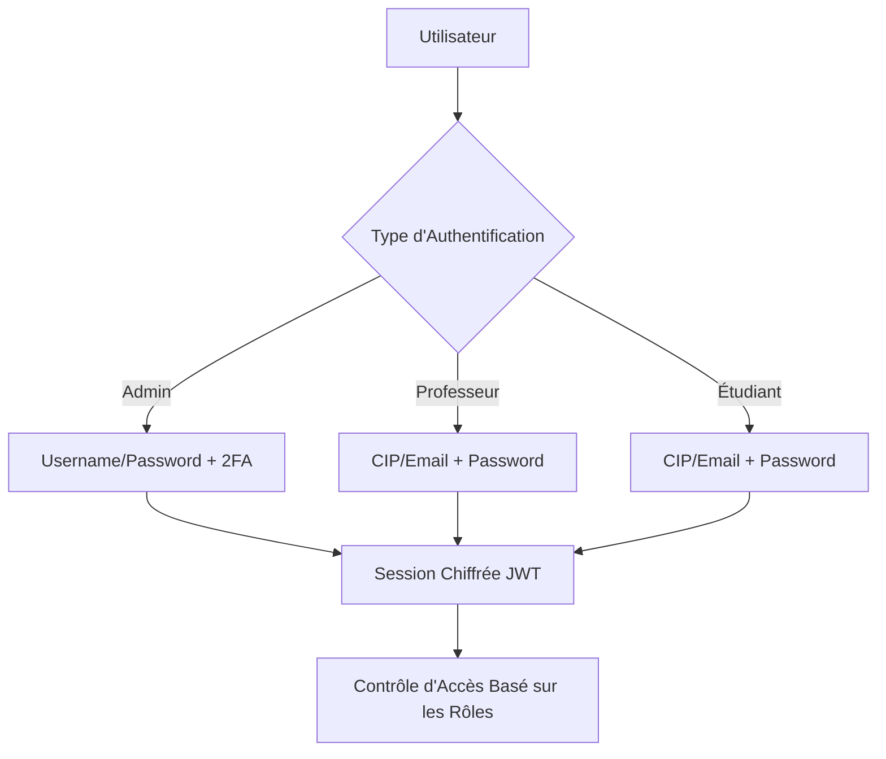
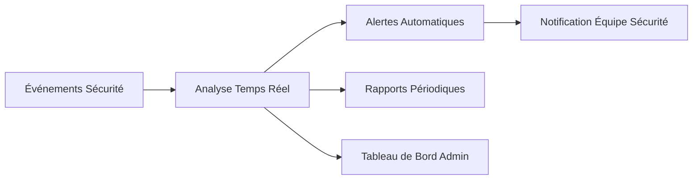
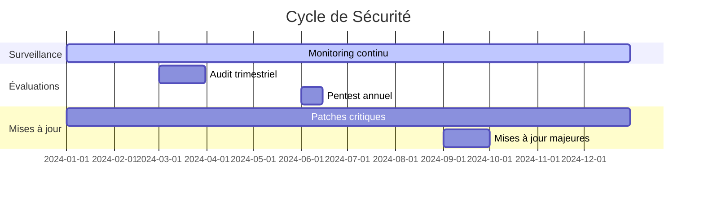

# 🛡️ Politique de Sécurité - ULC-ICAM Turnin System

<div align="center">


**🏢 Développé par [Cognito Inc.](https://cognito-inc.ca)**  
**Sécurité Enterprise pour l'Éducation**

</div>

---

## 📋 Table des Matières

- [🎯 Vue d'Ensemble](#-vue-densemble)
- [🔐 Authentification et Autorisation](#-authentification-et-autorisation)
- [🛡️ Protection des Données](#️-protection-des-données)
- [🔒 Chiffrement](#-chiffrement)
- [🚫 Prévention des Vulnérabilités](#-prévention-des-vulnérabilités)
- [📊 Monitoring et Audit](#-monitoring-et-audit)
- [🚨 Gestion des Incidents](#-gestion-des-incidents)
- [📞 Signalement de Vulnérabilités](#-signalement-de-vulnérabilités)
- [🔄 Mises à Jour de Sécurité](#-mises-à-jour-de-sécurité)

---

## 🎯 Vue d'Ensemble

Le système ULC-ICAM Turnin implémente une architecture de sécurité multicouche conçue pour protéger les données éducatives sensibles et garantir l'intégrité du processus académique.

### 🏛️ **Principes de Sécurité**

- **🔐 Défense en Profondeur** - Multiples couches de protection
- **🎯 Principe du Moindre Privilège** - Accès minimal nécessaire
- **🔍 Transparence Sécurisée** - Audit complet des actions
- **🚫 Zéro Confiance** - Vérification continue des accès
- **📊 Conformité Réglementaire** - Respect des standards éducatifs

---

## 🔐 Authentification et Autorisation

### 🎫 **Système d'Authentification Multi-Niveaux**



### 🔑 **Mécanismes d'Authentification**

| Rôle | Méthode | Sécurité Additionnelle |
|------|---------|------------------------|
| 👨💼 **Admin** | Username/Password | 2FA recommandé, Session timeout 30min |
| 👨🏫 **Professeur** | CIP ou Email/Password | Changement obligatoire du mot de passe temporaire |
| 👨🎓 **Étudiant** | CIP ou Email/Password | Verrouillage après 5 tentatives échouées |

### 🛡️ **Contrôle d'Accès (RBAC)**

```python
# Matrice des permissions
PERMISSIONS = {
    'admin': [
        'user.create', 'user.read', 'user.update', 'user.delete',
        'course.create', 'course.read', 'course.update', 'course.delete',
        'assignment.read', 'submission.read', 'system.config'
    ],
    'teacher': [
        'course.read', 'course.update', 'assignment.create', 
        'assignment.read', 'assignment.update', 'submission.read',
        'submission.grade', 'student.enroll'
    ],
    'student': [
        'course.read', 'assignment.read', 'submission.create',
        'submission.read', 'grade.read'
    ]
}
```

---

## 🛡️ Protection des Données

### 📊 **Classification des Données**

<div align="center">

| Niveau | Type de Données | Protection | Exemples |
|--------|-----------------|------------|----------|
| 🔴 **Critique** | Données personnelles sensibles | Chiffrement AES-256 | CIP, Notes, Données biométriques |
| 🟡 **Confidentiel** | Données académiques | Chiffrement TLS 1.3 | Devoirs, Corrections, Rapports |
| 🟢 **Interne** | Métadonnées système | Contrôle d'accès | Logs, Statistiques |
| ⚪ **Public** | Informations générales | Aucune restriction | Documentation publique |

</div>

### 🔒 **Mesures de Protection**

#### 📁 **Stockage Sécurisé**
```python
# Configuration de sécurité des fichiers
SECURITY_CONFIG = {
    'upload_folder': '/secure/uploads/',
    'max_file_size': 16 * 1024 * 1024,  # 16MB
    'allowed_extensions': {
        'code': ['.py', '.java', '.cpp', '.c', '.js'],
        'documents': ['.pdf', '.ppt', '.pptx'],
        'analysis': ['.pdf', '.doc', '.docx', '.txt']
    },
    'virus_scan': True,
    'content_validation': True
}
```

#### 🔐 **Isolation des Données**
- **Séparation par utilisateur** - Chaque utilisateur ne peut accéder qu'à ses propres données
- **Isolation des cours** - Les étudiants ne voient que leurs cours inscrits
- **Cloisonnement des rôles** - Permissions strictes selon le rôle

---

## 🔒 Chiffrement

### 🔐 **Chiffrement en Transit**

```bash
# Configuration TLS/SSL
SSL_PROTOCOLS = "TLSv1.2 TLSv1.3"
SSL_CIPHERS = "ECDHE-RSA-AES256-GCM-SHA384:ECDHE-RSA-AES128-GCM-SHA256"
SSL_PREFER_SERVER_CIPHERS = "on"
HSTS_MAX_AGE = 31536000
```

### 🗄️ **Chiffrement au Repos**

```python
# Chiffrement des données sensibles
from cryptography.fernet import Fernet

class DataEncryption:
    def __init__(self):
        self.key = os.environ.get('ENCRYPTION_KEY')
        self.cipher = Fernet(self.key)
    
    def encrypt_sensitive_data(self, data):
        """Chiffre les données sensibles (CIP, notes, etc.)"""
        return self.cipher.encrypt(data.encode())
    
    def decrypt_sensitive_data(self, encrypted_data):
        """Déchiffre les données sensibles"""
        return self.cipher.decrypt(encrypted_data).decode()
```

### 🔑 **Gestion des Clés**

- **Rotation automatique** des clés de chiffrement tous les 90 jours
- **Stockage sécurisé** des clés dans des variables d'environnement
- **Séparation des clés** par environnement (dev/test/prod)
- **Backup chiffré** des clés de récupération

---

## 🚫 Prévention des Vulnérabilités

### 🛡️ **Protection contre les Attaques Communes**

#### 🔒 **Injection SQL/NoSQL**
```python
# Utilisation de requêtes paramétrées
def safe_user_query(username):
    # ✅ Sécurisé - Paramètres liés
    query = "SELECT * FROM users WHERE username = ?"
    return db.execute(query, (username,))

# ❌ Vulnérable - Concaténation directe
# query = f"SELECT * FROM users WHERE username = '{username}'"
```

#### 🌐 **Cross-Site Scripting (XSS)**
```python
# Échappement automatique des données utilisateur
from markupsafe import escape

def render_user_content(content):
    return escape(content)  # Échappe automatiquement le HTML
```

#### 🔐 **Cross-Site Request Forgery (CSRF)**
```python
# Protection CSRF avec tokens
from flask_wtf.csrf import CSRFProtect

csrf = CSRFProtect(app)
app.config['SECRET_KEY'] = os.environ.get('CSRF_SECRET_KEY')
```

#### 📁 **Path Traversal**
```python
# Validation stricte des chemins de fichiers
import os
from werkzeug.utils import secure_filename

def safe_file_path(filename):
    # Sécurise le nom de fichier
    safe_name = secure_filename(filename)
    # Vérifie que le chemin reste dans le dossier autorisé
    full_path = os.path.join(UPLOAD_FOLDER, safe_name)
    if not full_path.startswith(UPLOAD_FOLDER):
        raise SecurityError("Path traversal attempt detected")
    return full_path
```

### 🔍 **Validation des Entrées**

```python
# Validation stricte des données d'entrée
class InputValidator:
    @staticmethod
    def validate_cip(cip):
        """Valide le format du CIP"""
        pattern = r'^[A-Z]{2}\d{6}$'
        return re.match(pattern, cip) is not None
    
    @staticmethod
    def validate_email(email):
        """Valide le format de l'email"""
        pattern = r'^[a-zA-Z0-9._%+-]+@[a-zA-Z0-9.-]+\.[a-zA-Z]{2,}$'
        return re.match(pattern, email) is not None
    
    @staticmethod
    def sanitize_code(code):
        """Nettoie le code soumis"""
        # Supprime les caractères dangereux
        dangerous_patterns = [
            r'import\s+os', r'import\s+subprocess', 
            r'exec\s*\(', r'eval\s*\('
        ]
        for pattern in dangerous_patterns:
            if re.search(pattern, code, re.IGNORECASE):
                raise SecurityError("Potentially dangerous code detected")
        return code
```

---

## 📊 Monitoring et Audit

### 📈 **Surveillance en Temps Réel**

```python
# Système de logging sécurisé
import logging
from datetime import datetime

class SecurityLogger:
    def __init__(self):
        self.logger = logging.getLogger('security')
        self.logger.setLevel(logging.INFO)
    
    def log_login_attempt(self, username, ip_address, success):
        """Enregistre les tentatives de connexion"""
        status = "SUCCESS" if success else "FAILED"
        self.logger.info(f"LOGIN_{status}: {username} from {ip_address}")
    
    def log_file_access(self, user, filename, action):
        """Enregistre l'accès aux fichiers"""
        self.logger.info(f"FILE_{action}: {user} accessed {filename}")
    
    def log_security_event(self, event_type, details):
        """Enregistre les événements de sécurité"""
        self.logger.warning(f"SECURITY_EVENT: {event_type} - {details}")
```

### 🔍 **Métriques de Sécurité**

- **Tentatives de connexion échouées** par utilisateur/IP
- **Accès aux fichiers sensibles** avec horodatage
- **Modifications de données critiques** avec traçabilité
- **Détection d'anomalies** dans les patterns d'utilisation
- **Performance des systèmes de sécurité**

### 📊 **Tableau de Bord Sécurité**



---

## 🚨 Gestion des Incidents

### 🚨 **Procédure de Réponse aux Incidents**

#### 1️⃣ **Détection et Signalement**
- **Monitoring automatique** 24/7
- **Alertes en temps réel** pour les événements critiques
- **Canaux de signalement** multiples pour les utilisateurs

#### 2️⃣ **Classification des Incidents**

| Niveau | Critères | Temps de Réponse | Actions |
|--------|----------|------------------|---------|
| 🔴 **Critique** | Violation de données, Système compromis | < 1 heure | Isolation immédiate, Notification direction |
| 🟡 **Élevé** | Tentatives d'intrusion, Vulnérabilités exploitées | < 4 heures | Investigation approfondie, Correctifs |
| 🟢 **Moyen** | Anomalies détectées, Violations de politique | < 24 heures | Analyse, Documentation |
| ⚪ **Faible** | Événements suspects mineurs | < 72 heures | Surveillance renforcée |

#### 3️⃣ **Réponse et Récupération**
```bash
# Plan de réponse automatisé
INCIDENT_RESPONSE_PLAN = {
    "isolation": "Isoler les systèmes affectés",
    "preservation": "Préserver les preuves numériques",
    "analysis": "Analyser l'étendue de l'incident",
    "containment": "Contenir la propagation",
    "eradication": "Éliminer la menace",
    "recovery": "Restaurer les services",
    "lessons_learned": "Documenter les leçons apprises"
}
```

### 📞 **Contacts d'Urgence Sécurité**

```
🚨 URGENCE SÉCURITÉ 24/7
📧 security@cognito-inc.ca
📱 +1 (XXX) XXX-XXXX (Ligne directe sécurité)

🏢 Cognito Inc. - Équipe Sécurité
👨💻 Jonathan Kakesa Nayaba (CEO/CISO)
📧 jonathan@cognito-inc.ca
```

---

## 📞 Signalement de Vulnérabilités

### 🔍 **Programme de Divulgation Responsable**

Cognito Inc. encourage la divulgation responsable des vulnérabilités de sécurité. Nous nous engageons à traiter tous les rapports de manière confidentielle et professionnelle.

#### 📋 **Processus de Signalement**

1. **📧 Envoyez un email** à `security@cognito-inc.ca`
2. **🔐 Chiffrez votre message** avec notre clé PGP publique
3. **📝 Incluez les détails** suivants :
   - Description détaillée de la vulnérabilité
   - Étapes pour reproduire le problème
   - Impact potentiel
   - Preuves de concept (si applicable)

#### ⏱️ **Délais de Réponse**

- **Accusé de réception** : < 24 heures
- **Évaluation initiale** : < 72 heures
- **Mise à jour du statut** : Hebdomadaire
- **Résolution** : Selon la criticité (1-90 jours)

#### 🏆 **Reconnaissance**

- **Hall of Fame** sur notre site web (avec permission)
- **Certificats de reconnaissance** pour les découvertes significatives
- **Récompenses** pour les vulnérabilités critiques (selon politique)

### 🚫 **Règles d'Engagement**

#### ✅ **Autorisé**
- Tests sur vos propres comptes de test
- Analyse statique du code (si accessible)
- Recherche de vulnérabilités communes (XSS, SQLi, etc.)

#### ❌ **Interdit**
- Accès non autorisé aux données d'autres utilisateurs
- Déni de service (DoS/DDoS)
- Destruction ou modification de données
- Divulgation publique avant résolution

---

## 🔄 Mises à Jour de Sécurité

### 📅 **Cycle de Mise à Jour**



### 🔧 **Types de Mises à Jour**

#### 🚨 **Patches Critiques**
- **Délai** : < 24 heures après découverte
- **Processus** : Déploiement d'urgence avec validation minimale
- **Communication** : Notification immédiate aux utilisateurs

#### ⚡ **Mises à Jour de Sécurité**
- **Délai** : < 7 jours
- **Processus** : Tests en environnement de staging puis production
- **Communication** : Annonce préalable avec fenêtre de maintenance

#### 🔄 **Mises à Jour Régulières**
- **Fréquence** : Mensuelle
- **Processus** : Cycle complet de développement et tests
- **Communication** : Planning publié à l'avance

### 📋 **Historique des Mises à Jour**

| Date | Version | Type | Description |
|------|---------|------|-------------|
| 2024-12-15 | 1.0.1 | Sécurité | Correction XSS dans l'éditeur de code |
| 2024-12-01 | 1.0.0 | Majeure | Version initiale de production |

---

## 📚 Ressources Additionnelles

### 📖 **Documentation Sécurité**

- **🔐 Guide de Configuration Sécurisée** : [docs.cognito-inc.ca/security-config](https://docs.cognito-inc.ca/security-config)
- **🛡️ Bonnes Pratiques Utilisateurs** : [docs.cognito-inc.ca/user-security](https://docs.cognito-inc.ca/user-security)
- **🚨 Procédures d'Incident** : [docs.cognito-inc.ca/incident-response](https://docs.cognito-inc.ca/incident-response)

### 🎓 **Formation Sécurité**

- **Formation Administrateurs** : Sécurisation et monitoring du système
- **Formation Professeurs** : Protection des données étudiants
- **Sensibilisation Étudiants** : Bonnes pratiques de sécurité numérique

### 🏆 **Certifications et Conformité**

- **ISO 27001** : Système de management de la sécurité de l'information
- **RGPD/GDPR** : Protection des données personnelles
- **SOC 2 Type II** : Contrôles de sécurité et disponibilité

---

<div align="center">

### 🛡️ **Sécurité de Niveau Enterprise**

**Développé avec les plus hauts standards de sécurité par [Cognito Inc.](https://cognito-inc.ca)**  
*Protection des données éducatives de l'Université Loyola du Congo*

---

[](https://cognito-inc.ca)
[](https://cognito-inc.ca)
[](https://cognito-inc.ca)

**Version Sécurité 1.0 | Décembre 2024 | Enterprise Ready**

</div>