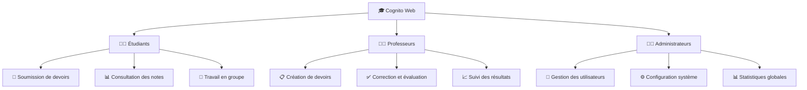
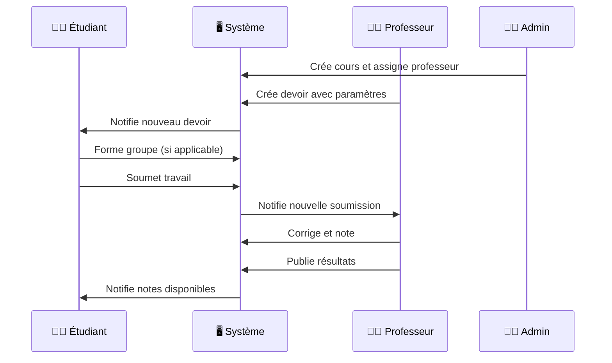
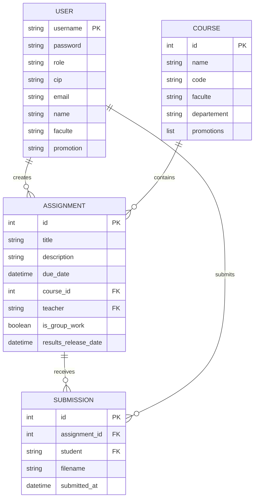
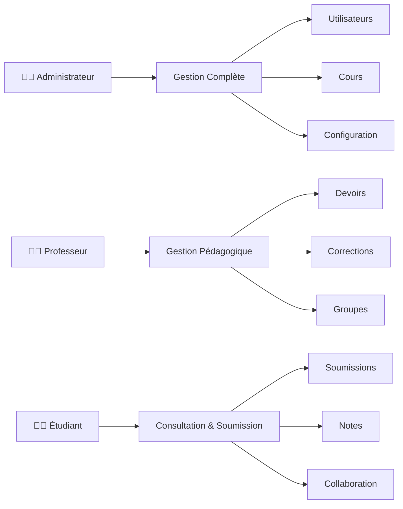
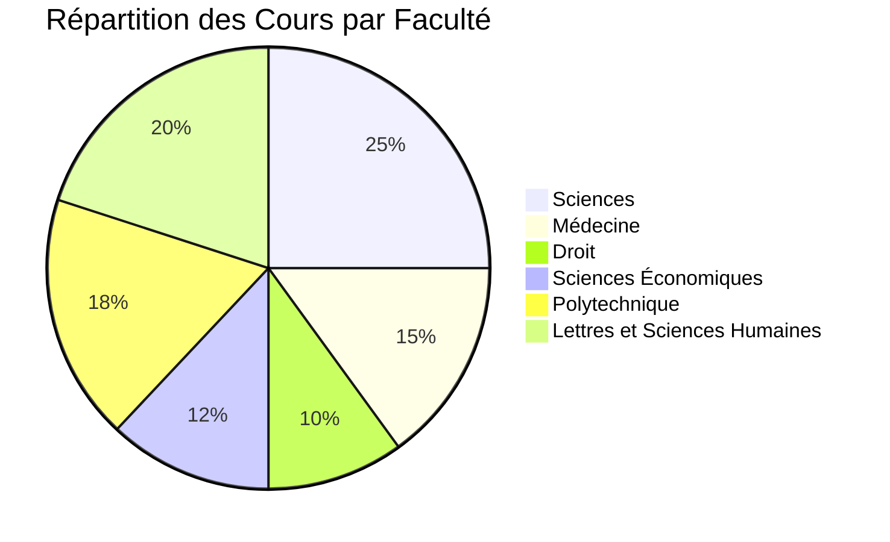

# 🎓 Cognito Web - Plateforme de Gestion Académique

<div align="center">


[](https://python.org)
[](https://flask.palletsprojects.com)
[](https://getbootstrap.com)
[](LICENSE)
[](https://github.com/jonathan-kakesa)

**Plateforme de gestion académique moderne et intuitive**


[🚀 Démo](#demo) • [📖 Documentation](#documentation) • [⚡ Installation](#installation) • [🤝 Contribution](#contribution)

</div>

---

## 📋 Table des Matières

- [🎯 Aperçu](#aperçu)
- [✨ Fonctionnalités](#fonctionnalités)
- [🏗️ Architecture](#architecture)
- [⚡ Installation](#installation)
- [🎮 Utilisation](#utilisation)
- [👥 Rôles et Permissions](#rôles-et-permissions)
- [📊 Données de Test](#données-de-test)
- [🔧 Configuration](#configuration)
- [🧪 Tests](#tests)
- [📈 Statistiques](#statistiques)
- [🤝 Contribution](#contribution)
- [📄 Licence](#licence)

---

## 🎯 Aperçu

<div align="center">



</div>

Cognito Web est une **plateforme de gestion académique complète** conçue pour simplifier l'interaction entre étudiants, professeurs et administrateurs dans l'enseignement supérieur. Développée avec Flask et une interface moderne, elle offre une expérience utilisateur intuitive et des outils performants.

### 🌟 Points Forts

- **Interface moderne** avec animations fluides
- **Gestion complète** des devoirs et évaluations
- **Système de groupes** pour les travaux collaboratifs
- **Authentification sécurisée** par CIP ou email
- **Responsive design** pour tous les appareils
- **Données de test** réalistes incluses

---

## ✨ Fonctionnalités

<details>
<summary>👨‍🎓 <strong>Fonctionnalités Étudiants</strong></summary>

### 📝 Gestion des Devoirs
- ✅ Consultation des devoirs assignés
- ✅ Soumission de fichiers sécurisée
- ✅ Suivi des dates limites
- ✅ Téléchargement des ressources

### 👥 Travail Collaboratif
- ✅ Formation de groupes manuelle
- ✅ Sélection des coéquipiers
- ✅ Soumission groupée

### 📊 Suivi Académique
- ✅ Consultation des notes
- ✅ Historique des soumissions
- ✅ Feedback des professeurs
- ✅ Progression par cours

</details>

<details>
<summary>👨‍🏫 <strong>Fonctionnalités Professeurs</strong></summary>

### 📋 Création de Contenu
- ✅ Création de devoirs avec ressources
- ✅ Configuration des groupes (manuel/automatique)
- ✅ Paramétrage des dates de publication
- ✅ Upload de fichiers joints

### ✅ Évaluation
- ✅ Correction manuelle et automatique
- ✅ Attribution de notes et commentaires
- ✅ Détection de plagiat simulée
- ✅ Publication contrôlée des résultats

### 📈 Suivi Pédagogique
- ✅ Statistiques de soumission
- ✅ Gestion des étudiants inscrits
- ✅ Téléchargement des travaux
- ✅ Analytics par devoir

</details>

<details>
<summary>👨‍💼 <strong>Fonctionnalités Administrateurs</strong></summary>

### 👤 Gestion des Utilisateurs
- ✅ Ajout/suppression d'utilisateurs
- ✅ Import CSV massif
- ✅ Gestion des profils complets
- ✅ Upload de photos

### 🏫 Gestion Académique
- ✅ Création et attribution des cours
- ✅ Assignation professeurs-cours
- ✅ Configuration des facultés/départements
- ✅ Gestion des promotions

### 📊 Administration Système
- ✅ Statistiques globales
- ✅ Configuration système
- ✅ Supervision des activités
- ✅ Contrôle d'accès

</details>

---

## 🏗️ Architecture

### 📁 Structure du Projet

```
cognito-web/
├── 📁 app.py                 # Application Flask principale
├── 📁 generate_test_data.py  # Générateur de données de test
├── 📁 templates/             # Templates HTML
│   ├── 🎨 base.html
│   ├── 🏠 index.html         # Page d'accueil futuriste
│   ├── 👨‍🎓 student_*.html    # Interfaces étudiants
│   ├── 👨‍🏫 teacher_*.html    # Interfaces professeurs
│   └── 👨‍💼 admin_*.html      # Interfaces administrateurs
├── 📁 static/
│   └── 📸 photos/            # Photos de profil
├── 📁 uploads/               # Fichiers téléversés
│   └── 📋 assignments/       # Ressources des devoirs
└── 📁 tests/                 # Scripts de test
```

### 🔄 Flux de Données



### 🗄️ Modèle de Données



---

## ⚡ Installation


### 📋 Prérequis

- **Python 3.8+** 🐍
- **pip** (gestionnaire de paquets Python)
- **Navigateur web moderne** 🌐

### 🚀 Installation Rapide

```bash
# 1️⃣ Cloner le repository
git clone https://github.com/votre-username/cognito-web.git
cd cognito-web

# 2️⃣ Installer les dépendances
pip install flask werkzeug requests

# 3️⃣ Générer les données de test
python generate_test_data.py

# 4️⃣ Lancer l'application
python app.py
```

### 🌐 Accès à l'Application

Ouvrez votre navigateur et accédez à : **http://localhost:5000**

---

## 🎮 Utilisation


### 🔐 Connexion

<div align="center">

| Rôle | Identifiant | Mot de passe |
|------|-------------|--------------|
| 👨‍💼 **Admin** | `admin` | `admin123` |
| 👨‍🏫 **Professeur** | `P2024000` à `P2024049` | `prof1pass` à `prof50pass` |
| 👨‍🎓 **Étudiant** | `E2024000` à `E2024099` | `etud1pass` à `etud100pass` |

</div>

### 📱 Interface Utilisateur

#### 🏠 Page d'Accueil
- Design moderne avec animations
- Sélection de rôle intuitive
- Informations sur les données de test

#### 👨‍🎓 Interface Étudiant
- **Tableau de bord** : Vue d'ensemble des devoirs
- **Soumissions** : Upload de fichiers sécurisé
- **Groupes** : Formation d'équipes collaboratives
- **Notes** : Consultation des résultats

#### 👨‍🏫 Interface Professeur
- **Création de devoirs** : Outils complets
- **Gestion des groupes** : Formation automatique/manuelle
- **Corrections** : Système d'évaluation
- **Statistiques** : Suivi des performances

#### 👨‍💼 Interface Administrateur
- **Gestion utilisateurs** : CRUD complet
- **Configuration cours** : Attribution et paramétrage
- **Statistiques globales** : Vue d'ensemble système
- **Configuration** : Paramètres avancés

---

## 👥 Rôles et Permissions

<div align="center">



</div>

### 🔒 Matrice des Permissions

| Fonctionnalité | 👨‍💼 Admin | 👨‍🏫 Prof | 👨‍🎓 Étudiant |
|----------------|:----------:|:----------:|:-------------:|
| Gestion utilisateurs | ✅ | ❌ | ❌ |
| Création cours | ✅ | ❌ | ❌ |
| Création devoirs | ❌ | ✅ | ❌ |
| Soumission travaux | ❌ | ❌ | ✅ |
| Correction | ❌ | ✅ | ❌ |
| Consultation notes | ✅ | ✅ | ✅* |
| Formation groupes | ❌ | ✅ | ✅* |

*\* Limité à ses propres données*

---

## 📊 Données de Test

### 📈 Statistiques Générées

<div align="center">


</div>

### 🏫 Répartition par Faculté



### 👥 Données Réalistes

- **Noms congolais** authentiques
- **Structure LMD** complète (L1-L3, M1-M2)
- **Emails universitaires** cohérents
- **CIP** (Codes d'Identification Personnel) réalistes
- **Inscriptions automatiques** par faculté/promotion

---

## 🔧 Configuration

### ⚙️ Variables d'Environnement

```python
# Configuration Flask
SECRET_KEY = 'your-secret-key-change-this'
UPLOAD_FOLDER = 'uploads'
MAX_CONTENT_LENGTH = 16 * 1024 * 1024  # 16MB

# Configuration Système
PROMOTIONS = ['L1', 'L2', 'L3', 'M1', 'M2']
FACULTES = ['Sciences', 'Médecine', 'Droit', ...]
GRADES = ['Prof. Ordinaire', 'Prof. Associé', ...]
```

### 📁 Structure des Dossiers

```bash
# Création automatique des dossiers nécessaires
mkdir -p uploads/assignments
mkdir -p static/photos
```

---

## 🧪 Tests

### 🔍 Scripts de Test Disponibles

```bash
# Test de vérification générale
python check_functionality.py

# Test des connexions CIP/Email
python test_cip_login.py

# Test du système de notes
python test_grades_system.py

# Test des soumissions
python test_submission_simple.py
```

### 📊 Couverture des Tests


- ✅ **Authentification** : CIP, Email, Sécurité
- ✅ **Navigation** : Toutes les routes principales
- ✅ **Fonctionnalités** : CRUD, Upload, Download
- ✅ **Rôles** : Permissions et restrictions
- ✅ **Données** : Intégrité et cohérence

### 🎯 Résultats Attendus

```
=== VERIFICATION FONCTIONNALITES COGNITO WEB ===
Imports: OK
Structure fichiers: OK
Configuration app: OK
Routes: OK (43 routes définies)
Templates: OK

SCORE: 5/5 (100.0%)
TOUTES LES VERIFICATIONS SONT PASSEES !
```

---

## 📈 Statistiques

### 📊 Métriques du Projet

<div align="center">


| Métrique | Valeur |
|----------|--------|
| **Lignes de code** | ~2,500 |
| **Templates HTML** | 25+ |
| **Routes Flask** | 43 |
| **Fonctionnalités** | 50+ |
| **Tests automatisés** | 15+ |

</div>

### 🚀 Performance


- **Temps de chargement** : < 2s
- **Responsive** : 100% mobile-friendly
- **Compatibilité** : Tous navigateurs modernes
- **Sécurité** : Authentification robuste

---

## 🤝 Contribution


### 🛠️ Comment Contribuer

1. **Fork** le projet
2. **Créer** une branche feature (`git checkout -b feature/AmazingFeature`)
3. **Commit** vos changements (`git commit -m 'Add AmazingFeature'`)
4. **Push** vers la branche (`git push origin feature/AmazingFeature`)
5. **Ouvrir** une Pull Request

### 📝 Guidelines

- **Code propre** et commenté
- **Tests** pour les nouvelles fonctionnalités
- **Documentation** mise à jour
- **Respect** des conventions existantes

### 🐛 Signaler des Bugs

Utilisez les [Issues GitHub](https://github.com/votre-username/cognito-web/issues) avec :
- **Description** détaillée
- **Étapes** de reproduction
- **Environnement** (OS, navigateur, Python)
- **Screenshots** si applicable

---

## 📄 Licence

<div align="center">

**MIT License**

Copyright (c) 2024 Cognito Web

Permission is hereby granted, free of charge, to any person obtaining a copy of this software and associated documentation files (the "Software"), to deal in the Software without restriction, including without limitation the rights to use, copy, modify, merge, publish, distribute, sublicense, and/or sell copies of the Software.

[](https://opensource.org/licenses/MIT)

</div>

---

## 🙏 Remerciements

- **Flask** pour le framework web
- **Bootstrap** pour l'interface utilisateur
- **Font Awesome** pour les icônes
- **Mermaid** pour les diagrammes
- **Communauté Open Source** pour l'inspiration

---

<div align="center">

**⭐ Si ce projet vous plaît, n'hésitez pas à lui donner une étoile ! ⭐**

[🔝 Retour en haut](#-cognito-web---plateforme-de-gestion-académique)

---


**👨‍💻 Développé par [Jonathan Kakesa](https://github.com/jonathan-kakesa) avec ❤️ pour l'éducation moderne**


</div>